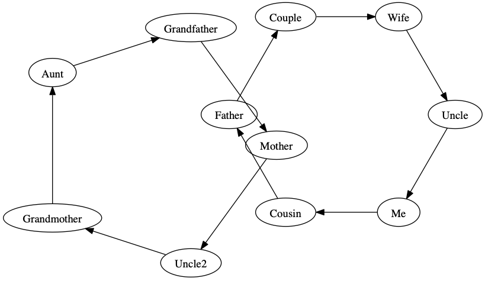

# Install

```
git clone github.com/kevarh/secretsanta
cd secretsanta
pip install -r requirements.txt
vi secretsanta.py
python secretsanta.py
```

## Editing...

There are two things you probably want to change.

1. The rules section says who _can't_ give to who. Use this to prevent X gives to Y (for example they live in the same household and are bad at hiding things.)
2. The _allsolutions_ variable can determine if you want one answer, or a random selection from all answers.


## Running

When running the script, it will find a solution and display it with Graphviz

## Example Output

```
python secretsanta.py
{'Me': 'Cousin', 'Cousin': 'Father', 'Wife': 'Uncle', 'Couple': 'Wife', 'Uncle2': 'Grandmother', 'Father': 'Couple', 'Grandfather': 'Mother', 'Grandmother': 'Aunt', 'Aunt': 'Grandfather', 'Mother': 'Uncle2', 'Uncle': 'Me'}
```


